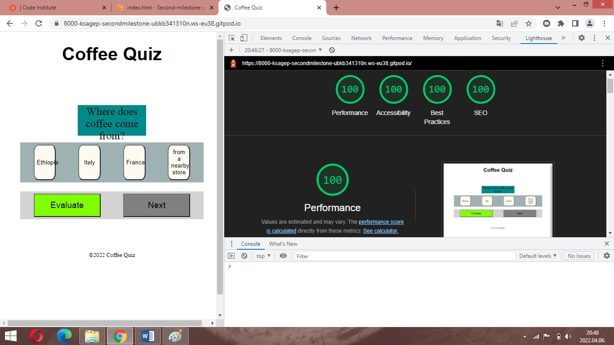
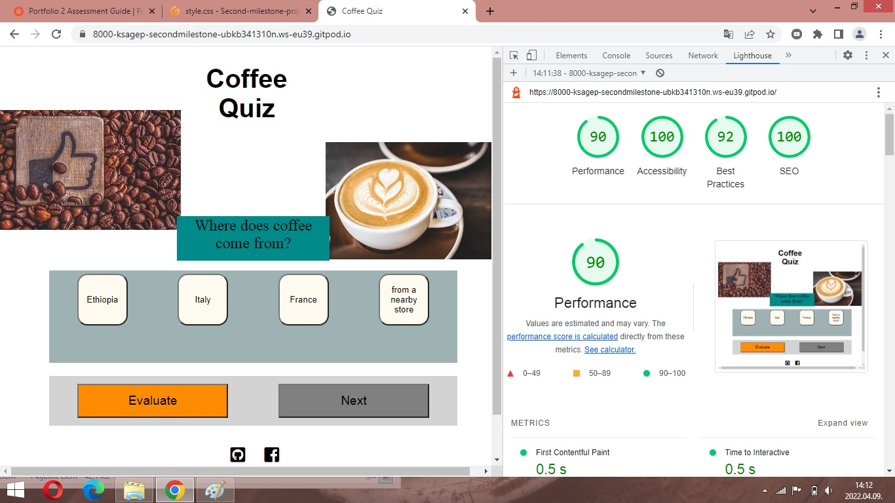

# Coffee Quiz

I took the advice of my mentor and the teachers of the Code Institute's Diploma in Software Development Course and I have created a quiz which I liked and enjoyed the development of it. I like coffee and I am interested in coffee, type of coffees and I make different type of coffees every day.

For link to this website click [Here]().

Design has been focused to *Desktop first* and *Responsive* but this quiz is also working on mobile phones.

## Who is this quiz for?

This quiz contains questions which are related to coffee. Players could play this quiz when drink their coffee or just like to know a litle bit more about coffee.

## What does this quiz do?

The quiz serves as a collection of interesting questions about coffee.

## UX summary

This page was created in a simple way. The information is clear and serves to help the visitors of the website.
My goals were as you can read below:
* Create fun interactive quiz for coffee-lovers who will hopefully enjoy it
* To make the quiz playable through use 10 questions
* Design the quiz aesthetically pleasing with simple and clear way
* To make the quiz responsive.

To achieve these goals I used JavaScript to create these fictional quiz. I used HTML and CSS for the content and to make a good look for it. Test the quiz with fans of coffee.

### Features for future implementation

* Could increase the number of questions that the player could play longer time with the quiz
* Create sets of questions with increasing levels of difficulty
* Attached relevant pictures to the questions

## Technologies

- HTML5 for basic structure of the website
- CSS3 for style the website
- Google Fonts for font family
- Font Awesome for social media icons
- Git for version control
- GitHub for storage the files and steps of development of the website

## Functionality

### Loading Screen

On the loading screen the user will see the title of the Quiz and the first question with answers which are related to it. The colour scheme is provided a characteristic for the loading screen.

### Questions and answers

When the users begins the quiz the first question with possible four answers is generated.
The answers are each in their own button. When clicked they will change the colour to blue. 

### Response the questions

When users chose a possible answer have to evaluate it. After it clicked the evaluate button they will generate a 'True' (green) or 'False' (red) note depending on if they click the right or wrong answers.

### Footer

The footer is simple and it contains to my Facebook (or Meta) and Instagram as well as copyright info also.

## Resources

- Code Institute course materials
- Code Institute Slack Community for some helps and idea
- Code Institute Mentor meetings and support
- Code Institute tutor support
- Am I Responsive for a responsive image in README

## Testing

### Browser testing

Website was tested in Google Chrome, Opera, Microsoft Edge and Safari. On each browser this website works properly (functionality, visuality).

It was tested on  Macbook Pro, Apple iPhone 13 Pro and Samsung A6 and A10 mobile phones and the website worked on these type of devices.

### Validators

The HTML was checked by W3C HTML validator and it did not reported any issues. You can find the result [Here]().

The CSS was checked by W3C Jigsaw validator it did not reported any issues. You can find the result [Here]().

The JS was checked by these [result]().

### Local testing

The buttons of the website were tested locally and these worked properly.
Links in footer were tested to ensure these link to the proper pages.

### Responsiveness

I used Google Chrome Dev Tools for this exercise. I tested for mobile and desktop devices and it worked properly.

Mobile test:

Desktop test:

## Version control

I used two repositories during the development: GitPod for local repository and GitHub for remote or background repository. 

I managed the versions with the following process:
- I created a repository in GitHub
- I opened and developped the repository in GitPod
- I created and developped the files and folders in GitPod
- I saved and pushed my works to GitHub repository:
    1. git add . - adding work to git
    2. git commit -m "Commit message" - to commit the stage of work
    3. git push - to update my work in GitHub

## Publishing

The steps of the publishing on the GitHub were as follow:
    
    1. **"Settings"** on the repository
    2. **"Source"** of "GitHub Pages" selected *master for Branch* and saved it
    3. The website was published on GitHub Pages and the link was provided in the same section.