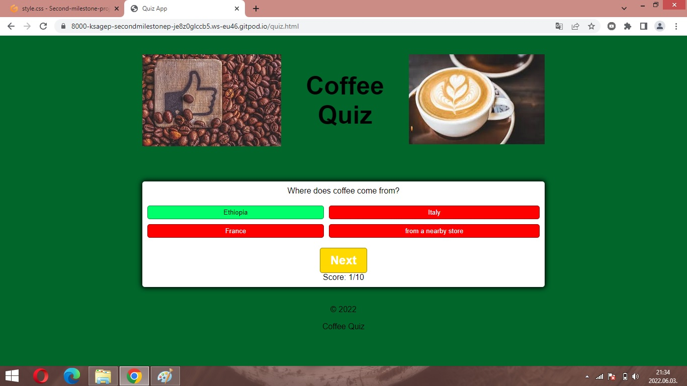
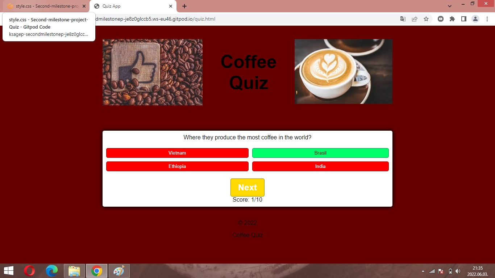

# Coffee Quiz

I took the advice of my mentor and the teachers of the Code Institute's Diploma in Software Development Course and I have created a quiz which I liked and enjoyed the development of it. I like coffee and I am interested in coffee, type of coffees and I make different type of coffees every day.

For link to this website click [Here](https://ksagep.github.io/Second-milestone-project-Quiz/).

Design has been focused to *Desktop, Laptop, Tablet first* and *Responsive* but this quiz is also working on mobile phones as you can see on the figure below.

## Who is this quiz for?

This quiz contains questions which are related to coffee. Players could play this quiz when drink their coffee or just like to know a litle bit more about coffee. The aim of this quiz that provide broader knowledge for player about coffee. The player will collect some interesting info about coffee, coffee making or history of coffee.

## What does this quiz do?

The quiz serves as a collection of interesting questions about coffee. The questions are shuffling in every game. The quiz provide colorful effect after choosen the question during the game. These red-green effect could  confirm the player's chose and help the "learning".

## UX summary

This page was created in a simple way. The information is clear and serves to help the visitors of the website.
My goals were as you can read below:
* Create fun interactive quiz for coffee-lovers who will hopefully enjoy it
* To make the quiz playable through use 10 questions
* Design the quiz aesthetically pleasing with simple and clear way
* To make the quiz responsive.

To achieve these goals I used JavaScript to create these fictional quiz. I used HTML and CSS for the content and to make a good look for it. Test the quiz with fans of coffee.

### Features for future implementation

* Could increase the number of questions that the player could play longer time with the quiz. The subject provide almost endless number of questions.
* Create sets of questions with increasing levels of difficulty. After this development, the game will be more exciting and variable for players.
* Attached relevant pictures to the questions. This step adds another sense organ to the game that can enhance the gaming experience.

## Technologies

- HTML5 for basic structure of the website
- CSS3 for style the website
- Google Fonts for font family
- Git for version control
- GitHub for storage the files and steps of development of the website

## Functionality

### Start Screen

On the start screen the user will see the title of the Quiz and two pictures which are related to the coffee. Furthermore, on this page you can find an intro text for game. It contains a header and a footer also.

### Intro page

This page shows the basic structure of the game and contains the start button for the quiz. The player can realize the places of answer buttons, the header and the footer.

### Questions and answers

When the users begins the quiz the first question with possible four answers is generated.
The answers are each in their own button. When clicked they will change the colour.
At correct answer you can see a similar pictures on your screen with green background color and button color:

If you had an incorrect answer the background and the button color will be red:

### End of the game

At the end of the game, the player's result will appear. In parallel with this a text also appear which its content is depend of the player's result. 

### Footer

The footer is simple and it contains copyright info.

## Resources

- Code Institute course materials
- Code Institute Slack Community for some helps and idea
- Code Institute Mentor meetings and support
- Code Institute tutor support
- Am I Responsive for a responsive image in README
- mikocoffee for image of the coffee beans
- pexels for image of cup of coffee

## Testing

### Browser testing

Website was tested in Google Chrome, Opera, Microsoft Edge and Safari. On each browser this website works properly (functionality, visuality).

It was tested on  Macbook Pro, Apple iPhone 13 Pro and Samsung A6 and A10 mobile phones and the website worked on these type of devices.

### Validators

The HTML was checked by W3C HTML validator and it did not reported any issues.
You can see the result below:

The CSS was checked by W3C Jigsaw validator it did not reported any issues.

The JS was checked via JSHint According to the assessment some functions are available in ES6 version. It was the reason that I got some warnings in the assessment.

and

 

### Local testing

The buttons of the website were tested locally and these worked properly.

### Responsiveness

I used Google Chrome Dev Tools for this exercise. I tested for mobile and desktop devices.

Mobile test:

Desktop test:

## Version control

I used two repositories during the development: GitPod for local repository and GitHub for remote or background repository. 

I managed the versions with the following process:
- I created a repository in GitHub
- I opened and developped the repository in GitPod
- I created and developped the files and folders in GitPod
- I used commit messages to help the development with short notices
- I saved and pushed my works to GitHub repository:
    1. git add . - adding work to git
    2. git commit -m "Commit message" - to commit the stage of work
    3. git push - to update my work in GitHub

## Publish the quiz

The steps of the publishing on the GitHub were as follow:
    
    1. **"Settings"** on the repository
    2. **"Source"** of "GitHub Pages" selected *master for Branch* and saved it
    3. The website was published on GitHub Pages and the link was provided in the same section.